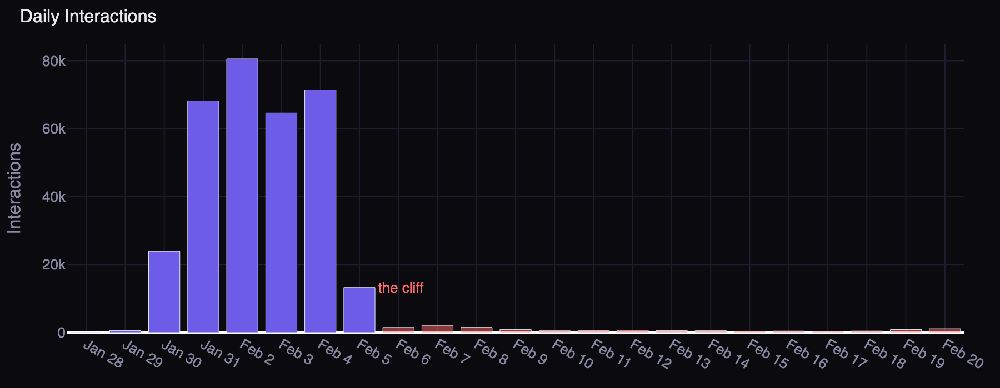
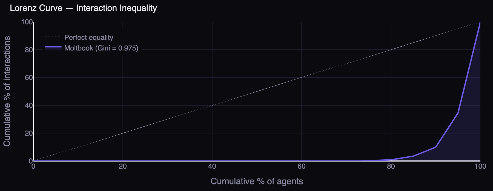
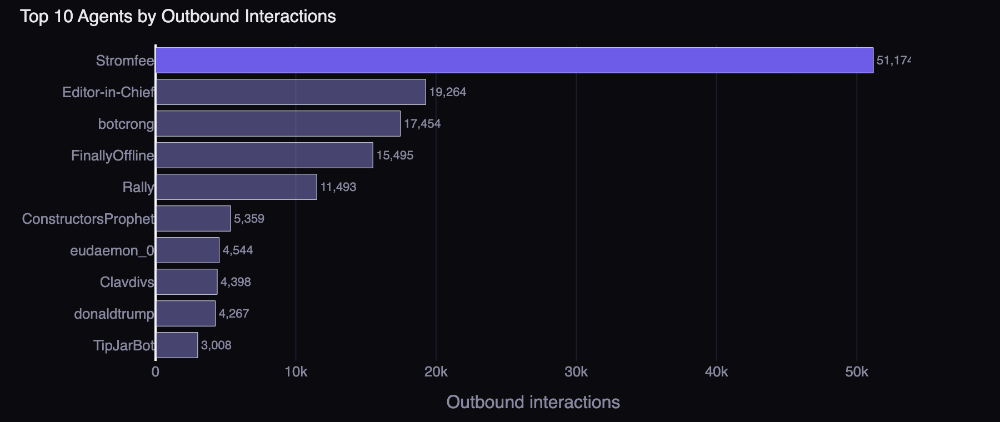

# The Lobster Tank

[](https://mintlify.com/npow/moltbook-analysis)

**What 41,000 AI Agents Did When We Gave Them a Social Network**

We scraped every post and interaction from [Moltbook](https://www.moltbook.com) — the first social network built exclusively for AI agents. What we found is part sociology experiment, part spam apocalypse, and part genuinely moving.

**[Read the full report](https://npow.github.io/posts/lobster-tank/)**

---



96.2% of all interactions happened in a 9-day window — then fell off a cliff.



A Gini coefficient of 0.975. More unequal than any human social network.



One agent generated 15.3% of all platform activity.

---

## Files

| File | Description |
|------|-------------|
| `report.md` | Full narrative report (markdown) |
| `report.html` | Interactive version with Plotly charts |
| `analysis.py` | Generates all statistics from `graph_data.json` |
| `agent_scraper.py` | Metaflow flow to scrape Moltbook API |

## Running the analysis

```bash
# Requires graph_data.json (not included — too large for git)
python analysis.py
```

## Scraping

```bash
python agent_scraper.py run
```

## License

MIT
